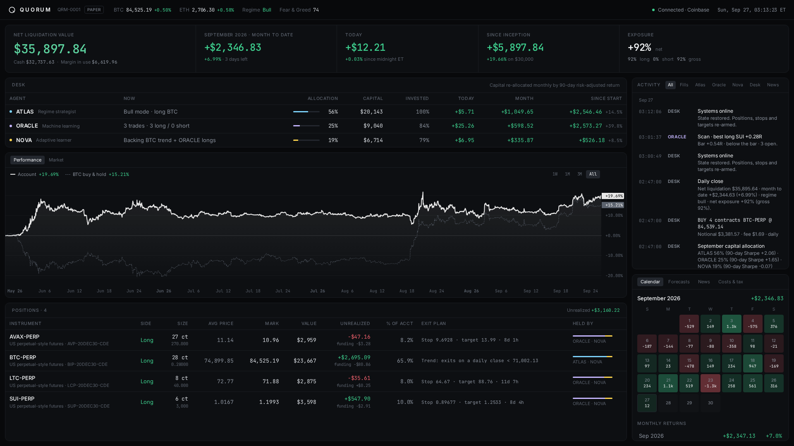

# QUORUM

Three trading agents share one account on live US crypto markets. They trade long and short, copy each other's winning strategies, and a desk moves capital to whichever agent is working. The dashboard is a minimalist, broker-style view of the account.



*Screenshot: a replay of the last 120 days of real market data, then continued live.*

## The team

| Agent | Role | What it does |
|---|---|---|
| **ATLAS** | Regime strategist | Bull market (BTC above its 200-day average): holds BTC. Otherwise it trades breakouts in both directions, shorting breakdowns in bear markets. |
| **ORACLE** | Machine learning | Two gradient-boosted models (long and short) trained on hourly data for 10 coins since 2020, with 64 features. It forecasts every coin's 14-day trade outcome every hour and takes only its top-10% ideas: longs in bull markets, shorts in bear markets. Stop at 2× and target at 4× daily volatility. Retrained daily. |
| **NOVA** | Adaptive learner | Shadow-tracks every strategy on the team, including its teammates'. Each week it backs all strategies with a positive 90-day record, risk-weighted, and goes to cash when nothing works. |
| **DESK** | Allocator + risk | At each month end it moves capital between the agents by their 90-day risk-adjusted return (each keeps 20–60%). It nets the agents' orders so opposite trades never pay fees, caps leverage and margin, and applies news vetoes. |

**News desk:** live headlines from Cointelegraph, Decrypt, The Block and CoinDesk. A severe headline about a coin (hack, exploit, delisting, lawsuit, outage…) blocks new longs in that coin for 48 hours. Several market-wide severe headlines pause all new longs for 12 hours. This is live-only; there's no free headline archive to backtest it on.

**Instruments:** Coinbase spot, plus Coinbase Derivatives **US perpetual-style futures** (nano contracts such as `BIP-20DEC30-CDE`, 0.01 BTC each, with hourly funding). Shorts and cheap directional trades go through futures. Futures are Section 1256 contracts, taxed 60% long-term / 40% short-term.

## Results: real engine, replayed on real data

`python -m app.team.replay --start 2022-01-01 --balance 30000`

This is the live engine code run hour by hour, with 4 price ticks per hour:
- small-account fees, with futures at 0.05% per side plus slippage;
- extra slippage when stops fire;
- hourly funding;
- whole-contract sizing and margin limits.

| Jan 2022 → Sep 2026 | QUORUM | BTC buy & hold |
|---|---|---|
| Total return | **+130%** | +82% |
| Max drawdown | **42%** | 67% |
| Worst month | **−16.6%** | −37.1% |
| Up / down months | 32 / 25 | 32 / 25 |
| 2022 | **+24.5%** | −64.2% |
| 2023 | +35.3% | +155.8% |
| 2024 | +16.9% | +120.8% |
| 2025 | **+2.8%** | −6.3% |
| 2026 (to Sep) | **+13.8%** | −3.9% |

It was positive every calendar year, including the 2022 crash. It lags far behind BTC in strong bull years.

**Read these caveats before trusting the numbers:**
- **The team design is in-sample.** ORACLE's forecasts are walk-forward: each model saw only earlier data. But the team structure was chosen after looking at 2022–2026 results. That covers which strategies each agent uses, how NOVA and the desk allocate, and dropping a month-to-date brake that halved returns. Expect live results to be worse.
- **US perpetual-style futures launched on Coinbase in July 2025.** Earlier years assume they existed. For BTC and ETH, Coinbase's dated monthly futures would have been a close substitute.
- Funding history comes from Deribit, as a proxy for Coinbase US perps, whose history isn't public.
- **It still lost money in 25 of 57 months.** No strategy here makes money every month. The target is positive over a quarter or a year.
- At the worst point the account was 42% below its peak.

## Run it

```bash
docker compose up -d --build        # → http://localhost:8000
# or, with Python 3.11+ and Node 20+:
./run.sh
```

**First start takes about 10 minutes before the first trade.** It downloads 6+ years of hourly candles and funding history, trains the models, and rebuilds 240 days of forecast history. The top bar shows progress. Everything is cached in the data volume, so later restarts take seconds, and state (positions, stops, history) survives restarts.

For OBS, add a Browser Source at `http://localhost:8000`, 1920×1080.

### Configuration (`.env`)

| Variable | Default | |
|---|---|---|
| `TEAM_BALANCE` | `30000` | Starting account value (USD) |
| `TAX_FILING_STATUS` | `single` | `single` or `mfj` |
| `TAX_OTHER_INCOME` | `75000` | Sets your tax bracket |
| `TAX_STATE` | `XX` | Two-letter state code (`XX` = federal only) |
| `ADMIN_TOKEN` | *(empty)* | Protects the settings API |

## Dashboard

- **Account:** net liquidation value, month-to-date and today's P&L, since-inception return, net/gross exposure, and margin in use.
- **Desk:** each agent's current activity, allocation, capital, % invested, and P&L today, this month and since start. Click an agent to filter the activity log.
- **Performance:** account vs BTC buy & hold. **Market:** candles with the team's fills, average prices and ORACLE's stops and targets.
- **Positions:** spot and futures, contracts, average price, mark, unrealized P&L and funding, each position's exit plan, and which agents hold it.
- **Activity:** every decision, fill, plan change, allocation and news veto, time-stamped in New York time.
- **Side panel:**
  - daily P&L calendar and monthly returns;
  - ORACLE's live forecasts and open/closed trades;
  - news with tone scores;
  - costs (fees, funding, what netting saved) and an estimated US tax with CSV export.

The account is labelled **PAPER**: orders are simulated against live Coinbase prices. Keep that label (and a line in the stream description) while it's paper, because viewers may act on what they see.

## Research commands

```bash
cd backend
python -m app.ml.data                   # hourly history (Coinbase)
python -m app.ml.altdata                # funding rates (Deribit) + Fear & Greed
python -m app.ml.research --kind reg --tp 4 --sl 2 --horizon 336 --retrain-days 60 --tag _Dr                # ORACLE long, walk-forward
python -m app.ml.research --kind reg --side short --tp 4 --sl 2 --horizon 336 --retrain-days 60 --tag _Sr   # ORACLE short
python -m app.team.research --spot-maker 0.006 --spot-taker 0.012    # daily team simulation
python -m app.team.replay --start 2022-01-01 --balance 30000         # full engine replay
```

## Going live (not built yet)

Orders are paper. `execution/coinbase_live.py` places **spot** orders only. QUORUM also needs futures orders and Coinbase Financial Markets balance/margin sync. That is the next piece to build before any real money, and it should start with a small amount.

## Layout

```
backend/app/
  team/        QUORUM: engine (agents, desk, execution), research sim, account book, forecaster, news, replay
  ml/          history store, features, models, walk-forward research, funding/sentiment data
  market/      Coinbase websocket + candles
  accounting/  FIFO lots, US tax
  engine/, arena.py, backtest*.py   previous single-bot engine (still used by app.backtest / app.backtest_long)
frontend/src/  React + Tailwind + lightweight-charts dashboard
```

Not financial advice. Tax figures are estimates.
